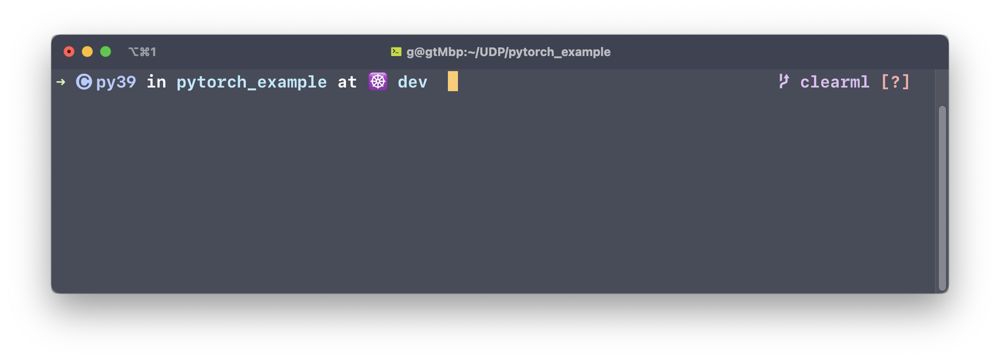
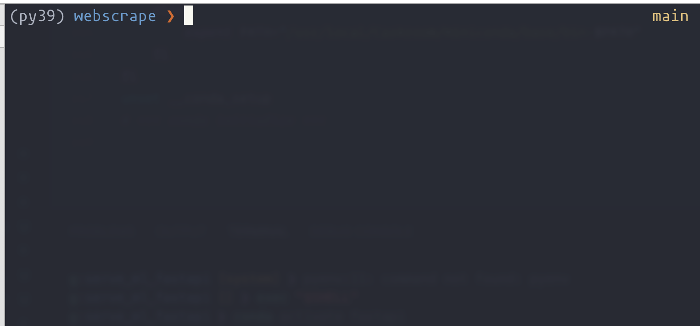

# Setup ZSH Theme 

## Spaceship Theme 


Using the [spaceship theme](https://github.com/spaceship-prompt/spaceship-prompt) : 

This shows the conda environment, current dir and kubectl context on the left, and the git branch on the right



my settings in .zshrc 
```
SPACESHIP_PROMPT_ORDER=(
  time     #
  vi_mode  # these sections will be
  user     # before prompt char
  host     #
  char
  conda
  dir
  # git
  kubectl
  docker
  # venv
  # pyenv
  node
  ruby
  xcode
  swift
  golang


)
SPACESHIP_RPROMPT_ORDER=(
  git
)


SPACESHIP_KUBECTL_SHOW=true
SPACESHIP_KUBECTL_VERSION_SHOW=false
SPACESHIP_KUBECONTEXT_SHOW=true
```

## Common Theme

I am using the [Common theme](https://github.com/jackharrisonsherlock/common)

Install the theme based on the github repo link above.


In $HOME/.zshrc, set your theme like this:
```
ZSH_THEME="common"
```

#### using conda environments

If you are using conda/miniconda, there are no modifications required for the common.zsh-theme.
It should show like this:




#### using pyenv 

I modified the prompt to show the curren pyenv using a zsh plugin

in .zshrc add the plugin pyenv, similar to below

```
plugins=(git
zsh-autosuggestions
pyenv
)
```

in common.zsh-theme, add `[$(pyenv_prompt_info)]` before `common_return_status`
```
# Left Prompt
 PROMPT='$(common_host)$(common_current_dir)$(common_bg_jobs)[$(pyenv_prompt_info)] $(common_return_status)'
``` 
 
See the result below.

In this case, the folder name is webscrape and the pyenv name is py39


