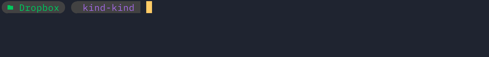
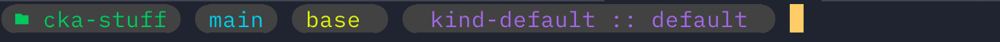

# An attempt at a minimal mac dev setup


## Install Homebrew

```bash
/bin/bash -c "$(curl -fsSL https://raw.githubusercontent.com/Homebrew/install/HEAD/install.sh)"
brew
(echo; echo 'eval "$(/opt/homebrew/bin/brew shellenv)"') >> /Users/g/.zprofile\
    eval "$(/opt/homebrew/bin/brew shellenv)"\
```    

## Install [Brew Cask Upgrade](https://github.com/buo/homebrew-cask-upgrade)
This would allow you to list and upgrade casks via the command `brew cu`
```bash
brew tap buo/cask-upgrade
```

## Install some utilities
```bash
brew install 1password dropbox iterm2 arc shottr firefox telegram
```

## Install dev tools
```bash
brew install colima kind docker docker-credential-helper docker-compose docker-buildx kubectl visual-studio-code zed micromamba gh
```

## Setup custom resolutions with [hipdpi script](https://github.com/xzhih/one-key-hidpi)
- This is for my ultra wide monitor (optional)
```bash
bash -c "$(curl -fsSL https://raw.githubusercontent.com/xzhih/one-key-hidpi/master/hidpi.sh)"
# set custom resolution of 2580x1080 in the script menus
```

## Setup ZSH

### ZSH Plugins

Add ZSH Autosuggestions
```bash
git clone https://github.com/zsh-users/zsh-autosuggestions ~/.zsh/zsh-autosuggestions
```

ZSH Syntax Highlighting
```bash 
git clone https://github.com/zsh-users/zsh-syntax-highlighting.git
echo "source ${(q-)PWD}/zsh-syntax-highlighting/zsh-syntax-highlighting.zsh" >> ${ZDOTDIR:-$HOME}/.zshrc
```

Append to the end of the file `.zshrc

It might look like this 
```bash
source ~/.zsh/zsh-autosuggestions/zsh-autosuggestions.zsh
source /opt/homebrew/share/zsh-syntax-highlighting/zsh-syntax-highlighting.zsh
```

### `oh-my-posh`

Modified Theme [bubblesline](https://github.com/JanDeDobbeleer/oh-my-posh/blob/main/themes/bubblesline.omp.json) to simplify the display 

You may view the config [here](ohmyposh.json)

Screenshot showing the Folder Name, and kubernetes context name



Screenshot showing folder name, git branch , python environment name and kubernetes context and namespace:




Source the theme using the snippet below 
```
#ohmyposh

# update the file name and path accordingly
OHMYPOSHTHEMEFILE=v2a.json

eval "$(oh-my-posh init zsh --config $HOME/.config/ohmyposh/$OHMYPOSHTHEMEFILE)"
if [ "$TERM_PROGRAM" != "Apple_Terminal" ]; then
  eval "$(oh-my-posh init zsh)"
fi
```

Reload the Shell: `exec $SHELL`
